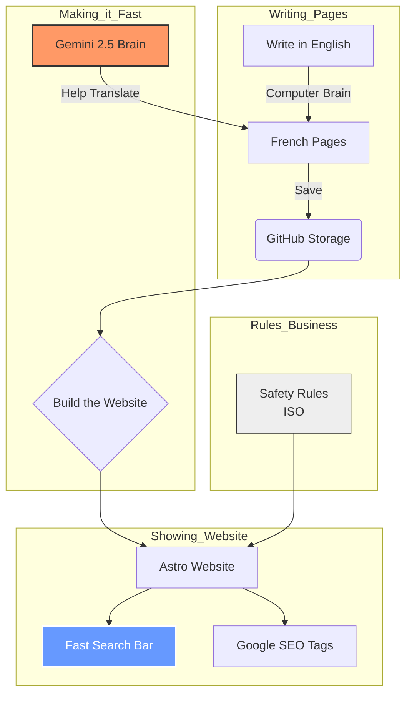

---
# Technical-Portfolio-2026

Bilingual Technical Documentation & AI-Augmented Workflows
built with **Astro + Starlight**.

---

## 🚀 The Big Picture: My Smart Book in Two Languages

This is a very fast website that helps people read about technology in both **English** and **French**. It uses a "computer brain" to help me write and keep everything safe.

### 🌟 4 Cool Things About This Site:
* **Smart Translation:** A computer brain called **Gemini 2.5** helps me change my English writing into French writing automatically.
* **Super Fast Search:** I use a tool called **Pagefind**. It helps you find any word on the site instantly, like magic!
* **Safety Rules:** We have special rules (called **ISO rules**) to make sure the computer is being fair and keeping your information safe.
* **The Store (API):** I added a special section that explains how we can charge money for people to use our smart tools.

### 🗺️ How It All Works (System Map)



---

## 📁 Standard Operating Procedures (SOPs)

This repository contains high-availability documentation
following a "Docs-as-Code" methodology.

| Document Title | Language | Compliance | Repo Link |
| :--- | :--- | :--- | :--- |
| **VPN + MFA (L3 Support)** | 🇺🇸 EN | ISO 27001 | [View Source](./portal/src/content/docs/en/operations/vpn-mfa-config.mdx) |
| **VPN + AMF (Soutien L3)** | 🇨🇦 FR-CA | Loi 96 | [View Source](./portal/src/content/docs/fr-ca/operations/vpn-mfa-config.mdx) |
| **VPN + MFA (Support L3)** | 🇫🇷 FR | RGPD | [View Source](./portal/src/content/docs/fr-ca/operations/vpn-mfa-config.mdx) |

---

## 🛠️ Tech Stack & Validation

- **Framework**: [Astro Starlight](https://technical-portfolio-woad.vercel.app/) (Documentation Engine).
- **Architecture**: Internationalization (i18n) with strict locale routing (`en`, `fr`, `fr-ca`).
- **Markdown**: Advanced frontmatter for automated sidebar generation.
- **AI & Search**: Gemini 2.5 (Translation) and Pagefind WASM (Instant Search).
- **Standards**: ISO 27001, OQLF (Loi 96) & RGPD (ANSSI).

---

## ⌨️ Developer Resources (Guides)

| Document | Language | Type | Repo Link |
| :--- | :--- | :--- | :--- |
| **API Quickstart** | 🇺🇸 EN | REST API | [View Source](./portal/src/content/docs/en/guides/auth-api-quickstart.mdx) |
| **Guide API** | 🇫🇷 FR | REST API | [View Source](./portal/src/content/docs/fr/guides/auth-api-quickstart.mdx) |

---

## ⚖️ Governance & Compliance

| Document | Language | Standards | Repo Link |
| :--- | :--- | :--- | :--- |
| **Data Privacy Policy** | 🇺🇸 EN | ISO 27001, GDPR | [View Source](./portal/src/content/docs/en/compliance/data-privacy.mdx) |
| **Politique de Confidentialité** | 🇫🇷 FR | ISO 27001, RGPD | [View Source](./portal/src/content/docs/fr/compliance/data-privacy.mdx) |
```